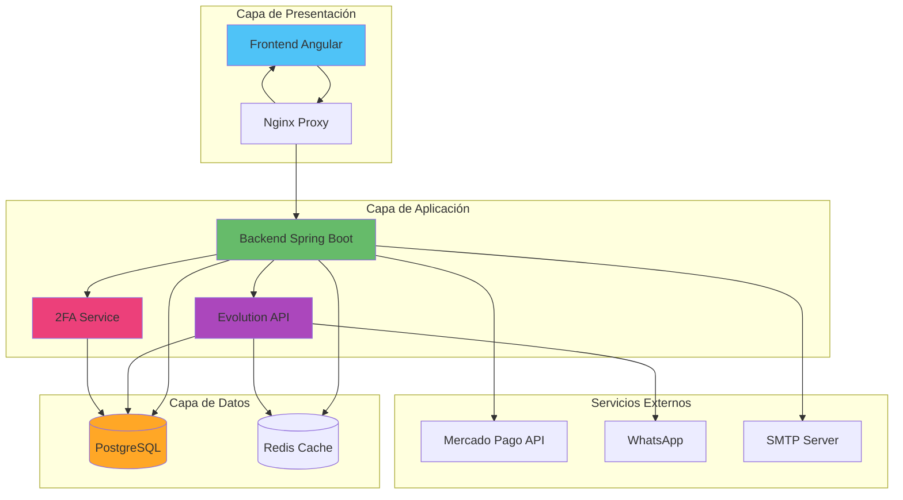
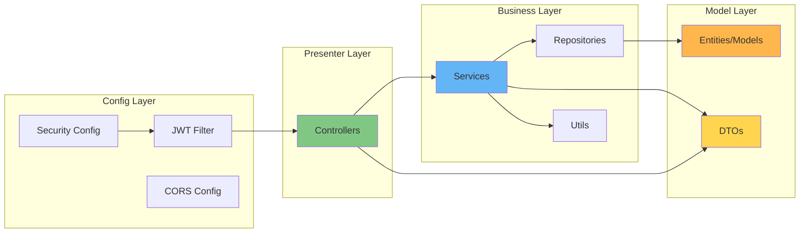
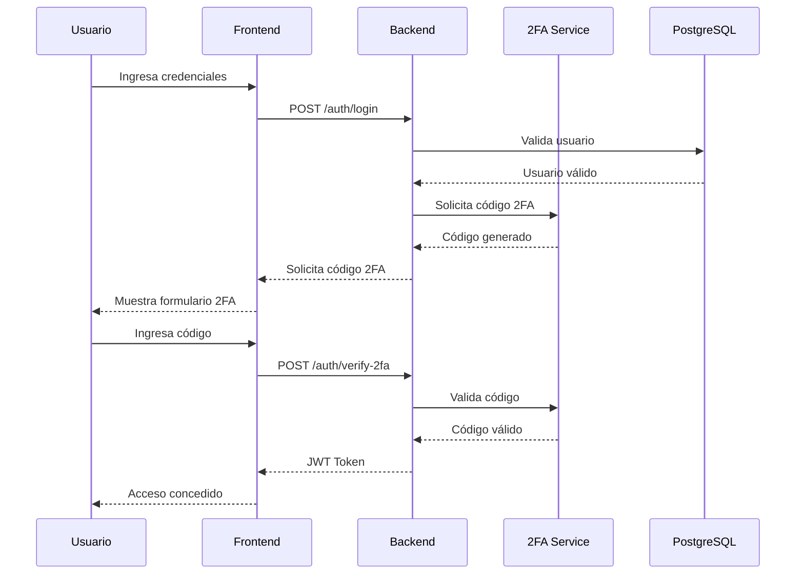
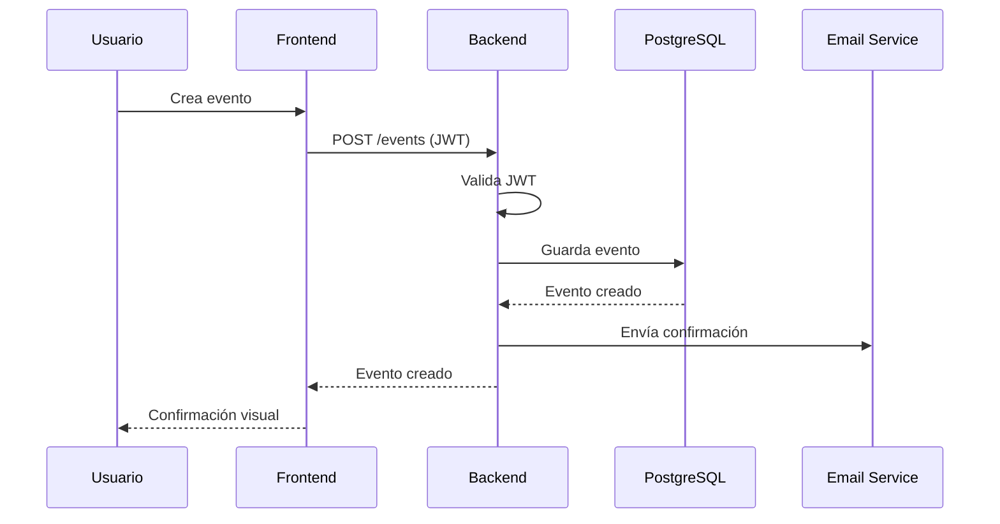
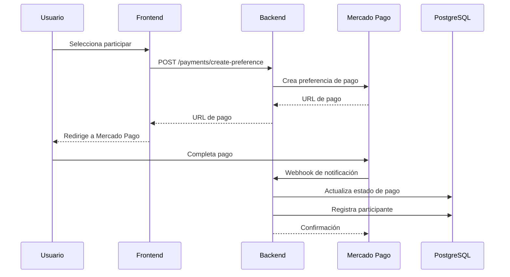

# Arquitectura de Alto Nivel del Sistema Raffify

## Descripción General

Raffify es un sistema de gestión de eventos (sorteos, rifas y concursos de adivinanza) construido con una arquitectura moderna de microservicios. El sistema permite a los usuarios crear, gestionar y participar en diferentes tipos de eventos, con integración de pagos, notificaciones por WhatsApp y autenticación de dos factores.

## Arquitectura General del Sistema

El sistema Raffify está diseñado siguiendo una **arquitectura de microservicios en capas**, separando responsabilidades y permitiendo escalabilidad independiente de cada componente.

---

## Separación por Capas

### 1. Capa de Presentación

Esta capa es responsable de la interfaz de usuario y la experiencia del usuario final.

#### **Frontend (Angular)**
- **Puerto**: 4200
- **Tecnología**: Angular 18+ con TypeScript
- **Responsabilidades**:
  - Renderizado de la interfaz de usuario
  - Gestión del estado de la aplicación
  - Comunicación con el backend mediante HTTP y WebSockets
  - Validación de formularios del lado del cliente
  - Gestión de rutas y navegación
  - Animaciones y experiencia de usuario

**Estructura Interna**:
- `pages/`: Componentes de páginas principales
- `services/`: Servicios para comunicación con APIs
- `guards/`: Protección de rutas y autorización
- `interceptors/`: Interceptores HTTP para tokens JWT
- `models/`: Interfaces TypeScript para tipos de datos
- `shared/`: Componentes reutilizables
- `pipes/`: Transformadores de datos para vistas
- `animations/`: Animaciones personalizadas

#### **Nginx Proxy**
- **Puerto**: 80
- **Responsabilidades**:
  - Enrutamiento de peticiones HTTP
  - Proxy reverso para frontend y backend
  - Balanceo de carga (si se escala)
  - Servir archivos estáticos
  - Configuración de CORS

---

### 2. Capa de Aplicación (Backend)

Esta capa contiene la lógica de negocio, procesamiento de datos y orquestación de servicios.

#### **Backend Principal (Spring Boot)**
- **Puerto**: 8080
- **Tecnología**: Spring Boot 3.3.3 con Java 21
- **Responsabilidades**:
  - Lógica de negocio principal
  - Gestión de eventos (Giveaways, Raffles, Guessing Contests)
  - Autenticación y autorización con JWT
  - Procesamiento de pagos con Mercado Pago
  - Envío de correos electrónicos
  - Generación de códigos QR
  - Auditoría de acciones del sistema
  - Gestión de usuarios y seguidores
  - Sistema de reportes y reseñas
  - WebSocket para chat en tiempo real

**Arquitectura Interna del Backend** (Patrón MVC + Servicios):

**Subcapas del Backend**:

##### **a) Presenter (Controladores)**
- **Ubicación**: `presenter/`
- **Función**: Exponer endpoints REST y manejar peticiones HTTP
- **Componentes principales**:
  - `AuthController`: Autenticación y registro
  - `EventsController`: CRUD de eventos
  - `PaymentController`: Gestión de pagos
  - `ParticipantController`: Inscripciones a eventos
  - `EvolutionController`: Integración con WhatsApp
  - `TwoFactorController`: Autenticación 2FA
  - `ChatController`: WebSocket para mensajería
  - `ReviewController`: Sistema de reseñas
  - `ReportController`: Reportes de contenido

##### **b) Business (Lógica de Negocio)**
- **Ubicación**: `business/services/`
- **Función**: Implementar la lógica de negocio y reglas del dominio
- **Componentes principales**:
  - `EventsService`: Lógica de eventos
  - `PaymentService`: Procesamiento de pagos
  - `ParticipantService`: Gestión de participantes
  - `AuthService`: Autenticación y autorización
  - `EmailService`: Envío de correos
  - `GuessProgressService`: Lógica de concursos de adivinanza
  - `RaffleNumberService`: Gestión de números de rifa
  - `JwtService`: Generación y validación de tokens
  - `AuditLogsService`: Registro de auditoría

##### **c) Repository (Acceso a Datos)**
- **Ubicación**: `business/repository/`
- **Función**: Abstracción de acceso a la base de datos usando Spring Data JPA
- **Patrón**: Repository Pattern
- **Características**:
  - Consultas automáticas por convención de nombres
  - Consultas personalizadas con `@Query`
  - Paginación y ordenamiento

##### **d) Model (Entidades y DTOs)**
- **Ubicación**: `model/` y `dto/`
- **Función**: Definir la estructura de datos
- **Entidades principales**:
  - `Events`: Eventos base
  - `Giveaways`: Sorteos gratuitos
  - `Raffle`: Rifas con números
  - `GuessingContest`: Concursos de adivinanza
  - `Participant`: Participantes
  - `Payment`: Pagos
  - `RegisteredUser`: Usuarios registrados
  - `Review`: Reseñas
  - `Report`: Reportes
  - `AuditLog`: Logs de auditoría

##### **e) Config (Configuración)**
- **Ubicación**: `config/`
- **Función**: Configuración de seguridad, CORS, WebSocket, etc.
- **Componentes**:
  - `SecurityConfig`: Configuración de Spring Security
  - `JwtAuthenticationFilter`: Filtro de autenticación JWT
  - `CorsConfig`: Configuración de CORS
  - `WebSocketConfig`: Configuración de WebSocket/STOMP

**Dependencias Principales**:
- Spring Boot Web (REST APIs)
- Spring Data JPA (Persistencia)
- Spring Security (Autenticación/Autorización)
- Spring WebSocket (Chat en tiempo real)
- JWT (Tokens de autenticación)
- ModelMapper (Mapeo DTO-Entity)
- ZXing (Generación de QR)
- Spring Mail (Envío de emails)
- PostgreSQL Driver
- Spring Actuator (Monitoreo)

---

#### **Evolution API (WhatsApp Integration)**
- **Puerto**: 8081
- **Tecnología**: Node.js con Baileys
- **Responsabilidades**:
  - Gestión de instancias de WhatsApp
  - Envío de mensajes de texto
  - Generación de códigos QR para conexión
  - Integración con OpenAI para chatbot
  - Almacenamiento de sesiones de WhatsApp

**Características**:
- Autenticación mediante API Key
- Base de datos compartida con backend (esquema `evolution`)
- Cache con Redis para mejorar rendimiento
- Soporte para múltiples instancias simultáneas

---

#### **2FA Service (Autenticación de Dos Factores)**
- **Puerto**: 8082
- **Tecnología**: Spring Boot (microservicio independiente)
- **Responsabilidades**:
  - Generación de códigos TOTP (Time-based One-Time Password)
  - Validación de códigos 2FA
  - Gestión de secretos de usuarios
  - Esquema de base de datos independiente (`twofa`)

**Características**:
- Microservicio completamente desacoplado
- Base de datos compartida pero esquema aislado
- API REST para integración con backend principal

---

### 3. Capa de Datos

Esta capa es responsable del almacenamiento persistente y temporal de datos.

#### **PostgreSQL Database**
- **Puerto**: 5432
- **Versión**: 16
- **Responsabilidades**:
  - Almacenamiento persistente de datos
  - Gestión de transacciones ACID
  - Integridad referencial
  - Consultas complejas y joins

**Esquemas**:
- `public`: Datos principales del backend (eventos, usuarios, pagos, etc.)
- `evolution`: Datos de Evolution API (sesiones, mensajes)
- `twofa`: Datos del servicio 2FA (secretos, códigos)

**Características**:
- Healthcheck para garantizar disponibilidad
- Volumen persistente para datos
- Acceso mediante PgAdmin para administración

#### **Redis Cache**
- **Puerto**: 6379
- **Versión**: 7 Alpine
- **Responsabilidades**:
  - Cache de sesiones de Evolution API
  - Cache de datos frecuentemente accedidos
  - Mejora de rendimiento general

---

### 4. Servicios Externos

#### **Mercado Pago API**
- **Función**: Procesamiento de pagos
- **Integración**: Mediante SDK de Mercado Pago
- **Características**:
  - Creación de preferencias de pago
  - Webhooks para notificaciones de pago
  - Validación de pagos

#### **SMTP Server**
- **Función**: Envío de correos electrónicos
- **Uso**:
  - Confirmación de registro
  - Recuperación de contraseña
  - Notificaciones de eventos
  - Confirmación de participación

#### **WhatsApp (vía Evolution API)**
- **Función**: Notificaciones por WhatsApp
- **Características**:
  - Mensajes de confirmación
  - Notificaciones de ganadores
  - Recordatorios de eventos

---

## Flujo de Comunicación

### Flujo de Autenticación

### Flujo de Creación de Evento

### Flujo de Pago

---

## Ventajas de esta Arquitectura

### **1. Separación de Responsabilidades**
Cada capa tiene responsabilidades bien definidas, facilitando el mantenimiento y evolución del sistema.

### **2. Escalabilidad**
Los microservicios pueden escalarse independientemente según la demanda:
- Evolution API puede escalar para manejar más mensajes de WhatsApp
- Backend puede escalar horizontalmente con balanceo de carga
- Base de datos puede replicarse para lectura

### **3. Mantenibilidad**
- Código organizado por capas y responsabilidades
- Fácil localización de bugs
- Cambios aislados no afectan todo el sistema

### **4. Testabilidad**
- Cada capa puede probarse independientemente
- Mocks y stubs para servicios externos
- Tests unitarios, de integración y end-to-end

### **5. Seguridad en Capas**
- Autenticación JWT en el backend
- Autenticación 2FA opcional
- CORS configurado en Nginx
- API Keys para servicios internos
- Validación en frontend y backend

### **6. Resiliencia**
- Healthchecks para servicios críticos
- Reinicio automático de contenedores
- Cache para reducir carga en base de datos
- Volúmenes persistentes para datos críticos

---

## Tecnologías por Capa

| Capa | Tecnología | Versión |
|------|-----------|---------|
| **Frontend** | Angular | 18+ |
| **Frontend** | TypeScript | 5+ |
| **Frontend** | TailwindCSS | 3+ |
| **Backend** | Spring Boot | 3.3.3 |
| **Backend** | Java | 21 |
| **Evolution API** | Node.js + Baileys | Latest |
| **2FA Service** | Spring Boot | 3+ |
| **Base de Datos** | PostgreSQL | 16 |
| **Cache** | Redis | 7 |
| **Proxy** | Nginx | Alpine |
| **Contenedores** | Docker + Docker Compose | Latest |

---

## Conclusión

La arquitectura de Raffify está diseñada para ser **modular, escalable y mantenible**. La separación en capas y el uso de microservicios permite que cada componente evolucione independientemente, facilitando la adición de nuevas funcionalidades sin comprometer la estabilidad del sistema existente.

El uso de tecnologías modernas y probadas (Spring Boot, Angular, PostgreSQL, Redis) garantiza un sistema robusto y con soporte a largo plazo. La integración con servicios externos (Mercado Pago, WhatsApp) amplía las capacidades del sistema sin aumentar su complejidad interna.
